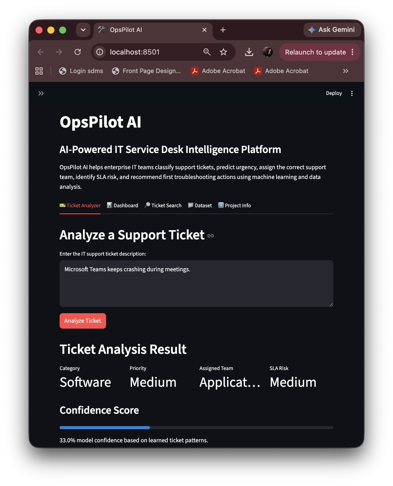
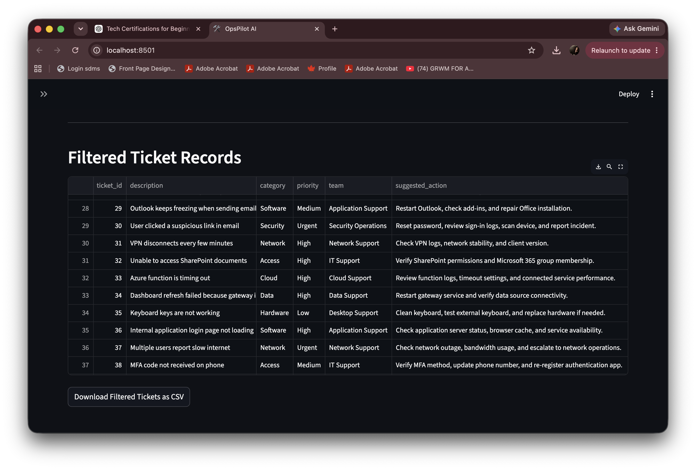
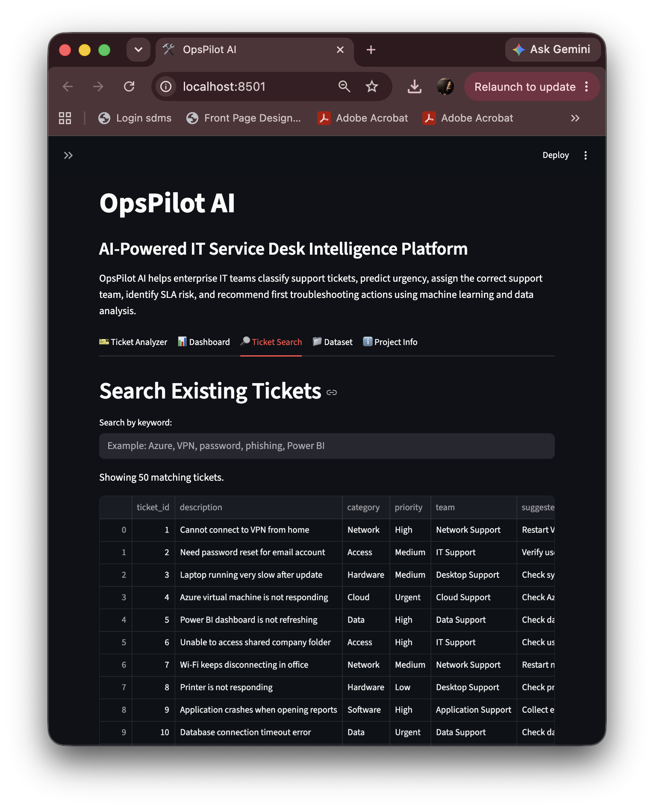
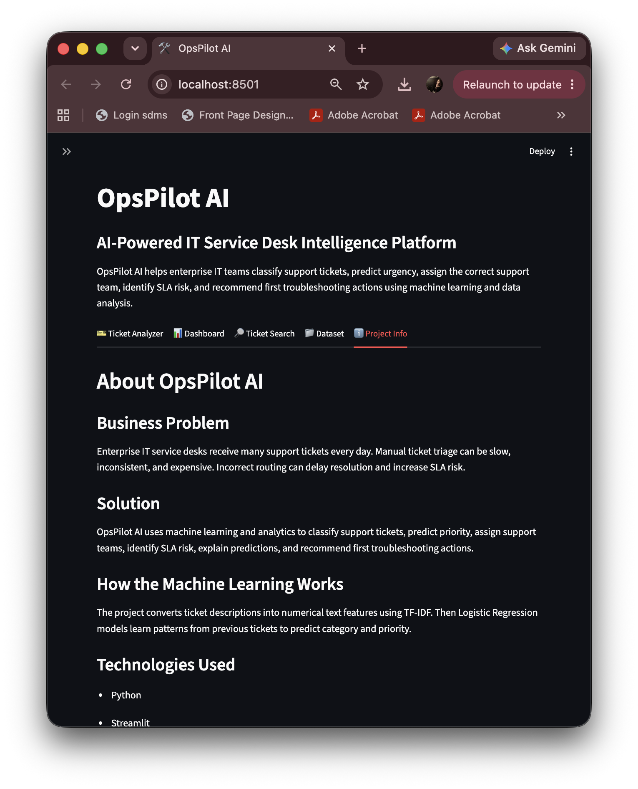

# OpsPilot AI

OpsPilot AI is an AI-powered IT service desk intelligence platform that helps enterprise support teams classify IT tickets, predict priority, assign the correct support team, identify SLA risk, and recommend first troubleshooting actions.

This project was created as a portfolio project to demonstrate practical skills in software development, machine learning, data analysis, and enterprise IT operations.

## Project Overview

Enterprise IT service desks receive many support tickets every day. Manual ticket triage can be slow, inconsistent, and costly. Incorrect ticket routing can delay resolution and increase SLA risk.

OpsPilot AI solves this problem by analyzing ticket descriptions and automatically predicting:

- Ticket category
- Ticket priority
- Assigned support team
- SLA risk level
- Suggested first action
- Similar past tickets

## Features

- Machine learning-based ticket classification
- Priority prediction
- SLA risk detection
- Support team assignment
- Confidence score
- Explainable prediction output
- Similar ticket search
- Interactive analytics dashboard
- Dataset search
- CSV export for filtered tickets

## Tech Stack

- Python
- Streamlit
- Pandas
- Scikit-learn
- TF-IDF Vectorization
- Logistic Regression
- Data visualization
- GitHub

## Machine Learning Approach

The project uses a machine learning pipeline to classify IT support tickets.

Ticket descriptions are converted into numerical text features using TF-IDF vectorization. Logistic Regression models are then trained to predict ticket category and priority based on previous ticket examples.

The app also uses cosine similarity to find similar past tickets from the dataset.

## Project Structure

```text
opspilot-ai/
├── app/
│   └── main.py
├── data/
│   └── tickets.csv
├── screenshots/
├── notebooks/
├── docs/
├── requirements.txt
├── .gitignore
└── README.md
```

## How to Run Locally

Clone the repository:

```bash
git clone https://github.com/YOUR-USERNAME/opspilot-ai.git
```

Go into the project folder:

```bash
cd opspilot-ai
```

Install dependencies:

```bash
pip3 install -r requirements.txt
```

Run the Streamlit app:

```bash
python3 -m streamlit run app/main.py
```

## Sample Use Case

A user enters:

```text
My Azure virtual machine is not responding.
```

OpsPilot AI predicts:

```text
Category: Cloud
Priority: Urgent
Assigned Team: Cloud Support
SLA Risk: Critical
```

## Screenshots

### Ticket Analyzer



### Dashboard



### Ticket Search



### Project Info



OpsPilot AI demonstrates how AI and machine learning can improve enterprise IT operations by reducing manual triage effort, improving ticket routing, identifying high-risk issues faster, and supporting better service desk decision-making.

## Future Improvements

- Deploy the app online
- Add Azure cloud deployment
- Store tickets in a database
- Add user authentication
- Add Power BI reporting
- Expand dataset for stronger model accuracy
- Add AI-generated troubleshooting recommendations
- Add admin dashboard for service desk managers

## Author

Manya Sethi
Software Development Student
Focused on Cloud, AI, Data, and Enterprise Software Solutions
